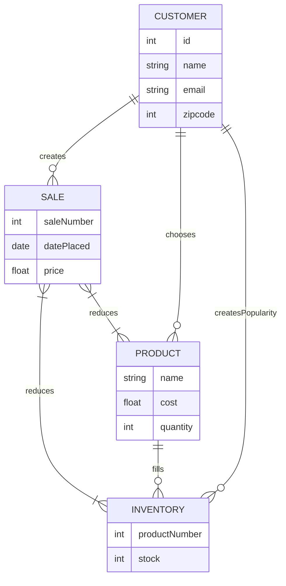

## Relations 
* A customer chooses a product and then creates a sale. 
* A sale reduces both inventory and the number of products available. 
* A customer also creates the popularity of inventory. 
* A product fills the inventory. 

### Importance 
 This is important to business due to customer popularity guiding which product to buy to fill our inventory. It also keeps track of where customers are coming from, the price of the average orders they're purchasing and much more valuable information.
