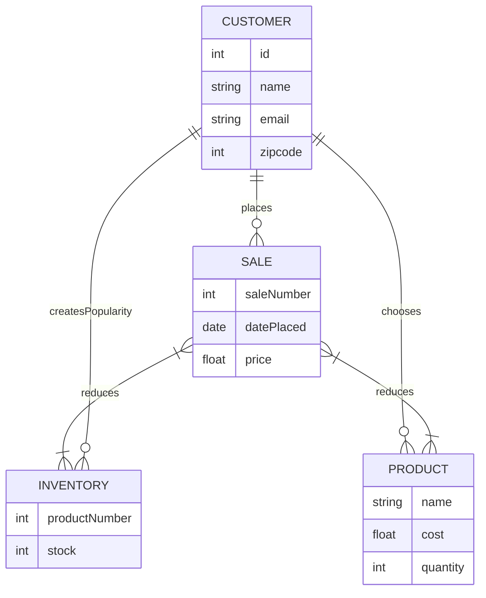

```mermaid
erDiagram

CUSTOMER ||--o{SALE : places
CUSTOMER ||--o{PRODUCT : chooses
SALE }|--|{INVENTORY : reduces
SALE }|--|{PRODUCT : reduces
CUSTOMER ||--o{INVENTORY : createsPopularity

PRODUCT {
string name
float cost
int quantity
}
CUSTOMER {
int id
string name
string email
int zipcode
}
SALE {
int saleNumber
date datePlaced
float price
}
INVENTORY {
int productNumber
int stock
}
```
